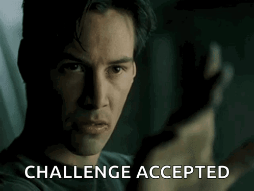

# 🎓Formação Scrum Master Certification da DIO 👨‍🎓(*Desafio 02*)
## Desafio 02 - Completando o Framework Scrum (utilizando o Miro)  
  
## 🎯Objetivo:
Utilizar o Miro, ferramenta muito utilizada no mundo da agilidade, para completar as informações sobre o conteúdo do Scrum por meio do template disponibilizado para uso no Miro.  
O intuito é aplicar tudo que foi aprendido até o momento.  
    

    
## 🤓Entendendo o Desafio:
>Passo a Passo:  
    
- 📋 1) Criar uma conta no Miro: [https://miro.com/pt/](https://miro.com/pt/)
- 📋 2) Acessar o link do Template do Miro (Link: [https://miro.com/app/board/uXjVPahls68=/?share_link_id=956189813435](https://miro.com/app/board/uXjVPahls68=/?share_link_id=956189813435))
- 📋 3) Duplicar o Template para sua conta
- 📋 4) Preencher os esquemas, conforme as instruções
- 📋 5) Exportar o seu resultado (PDF, Imagem, etc)
- 📋 6) Entregar o Projeto via repositório no GitHub

## 🤓Desafio Feito😎! Minha resolução🎉🎉🎉:
>### ✅Execução das instruções do Passo a Passo:  
>- Os **itens 1 e 2** que se resumem a Criar a conta no Miro e Acessar o link do Template informado, foram realizados com sucesso.  
>- Já o **item 3** que trata da duplicação do Template para conta criada, não ocorreu conforme previsto.  
>A duplicação não foi realizada, mesmo seguindo os passos conforme demonstrado no vídeo de orientação desta atividade.  
>Clicava na opção de **Duplicar** e nada ocorria, nem mesmo erro.  
>- Diante desta situação e com os pilares do Scrum em mente, resolvi **Adaptar**. O intuito desta atividade é ter contato com o Miro e, principalmente, trabalhar a assimilação dos conceitos aprendidos.  
>Então, acessei o Template para pegar a imagem dos Frames e escrever as respostas abaixo das imagens.  
>Mas percebi que era possível copiar os objetos. Então, fiz a copia de cada objeto para o Board na minha conta. E consegui prosseguir com a atividade.  
>- Após essa adaptação, realizei e conclui o **item 4** que se refere ao preenchimento dos esquemas, conforme instruções.  
>- Exportei o resultado desta atividade e inseri neste README, conforme orientação do **item 5**. Veja link e imagens abaixo!
>- Por fim, o **item 6** se resume a salvar este README, capturar o link e disponibilizar na plataforma da DIO.😄  
>
> 🤔OBS: Ficou a curiosidade: "Será que esse problema para duplicar ocorreu só comigo ou foi algo intencional para provocar os pilares do Scrum em nossas ações?❓❓❓  
---
>### Resultado das ações no Miro:
>- Link de visualização direto no Miro: [[Roberto Pfaltzgraff] Desafio de Projeto DIO - Scrum](https://miro.com/app/board/uXjVIXj7yPo=/?share_link_id=676983120475)  
>- ou visualizando as imagens abaixo:  
>
>  
>  
>  
---
