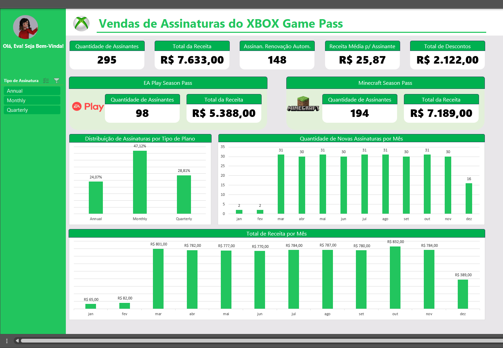

# 🎓Heineken⭐ - Bootcamp IA Aplicada a Dados com Copilot da DIO 👨‍🎓(*Desafio 01*)
## Desafio 01 - Criar um Dashboard de Vendas do Xbox com Excel  
  
## 🎯Objetivo:
Criar um dashboard de vendas do XBOX no Excel.  
O intuito é aplicar tudo que foi aprendido até o momento.  
      

    
## 🤓Entendendo o Desafio:
>Este desafio tem como objetivo a criação de um dashboard de vendas, com foco na organização e visualização de dados.  
>O intuito é transformar dados brutos em informações visuais claras e úteis, permitindo uma análise eficaz do desempenho de vendas e a tomada de decisões baseadas em dados.

>### O que fazer?  
>Criar um dashboard de vendas no Excel.  

>### Orientações para Entrega
>- Organizar o repositório do GitHub com:
>   - README.md explicando o projeto, os dados utilizados e instruções para reprodução.
>   - O arquivo Excel (.xlsx) com o dashboard concluído.
>- Compartilhar o link do repositório GitHub como entrega do desafio.

>### Materiais de Apoio
>- Base de Dados: [base.xlsx](https://hermes.dio.me/files/assets/805d54f9-6d53-4246-bed7-4aa2da615923.xlsx)
>- Dashboard Finalizado: [dashboard_xbox_finalizado.xlsx](https://hermes.dio.me/files/assets/0120950e-64c8-4092-a257-ba22ed198c69.xlsx)  

## 🤓Desafio Concluído😎! Segue minha resolução🎉🎉🎉:
>### ✅Dashboard concluído com sucesso!  
>O Dashboard foi desenvolvido considerando os dados de Vendas do XBOX fícticios, fornecido neste desafio de projeto.  
>Segue o link do Dashboard confeccionado no Excel conforme solicitado:  
>- [dashboard-xbox-desafio-concluido.xlsx](./dashboard-xbox-desafio-concluido.xlsx)  
>  

>Passos realizados na construção do Dashboard:
>- Utilizar o arquivo disponibilizado, **base.xlsx**, como ponto de partida.  
>- Começar na aba **Cálculo**, formulando questões que possam ser feitas sobre os dados da aba **Base**.  
>   - Marquei toda faixa da tabela de dados e utilizei o **Copilot**.  
>   - Fiz a seguinte solicitação ao **Copilot**:  
>   *Quais questões poderiam serem feitas sobre esses dados selecionados, A1:M296, para se montar um dashboard?*  
>   - OBS: Demais detalhes estão anotados/registrados na aba **Cálculo** do arquivo excel entregue.
>- Para cada questão, trabalhar os dados de modo a transformá-los na informação que responda a questão.  
>- Por fim, montar o Dashboard com as informações levantadas e disponibilizá-lo na aba **Dashboard**.  
  
>Imagem estática do Dashboard:  
>  
>😄🎉🔚  
>
---
